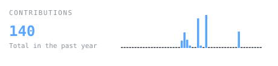
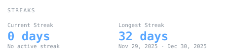
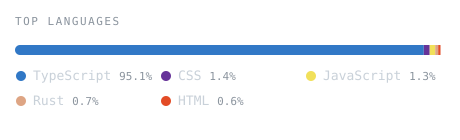
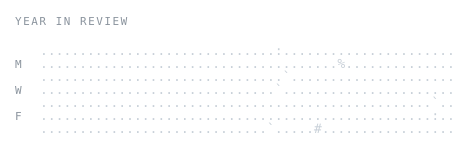

# kinzamalik18

<blockquote>
  <strong>Hi there, I'm Kinza!</strong>
  A builder, developer, and creator, always looking to optimize workflows and bring local-first ideas to life.
</blockquote>

 

<table align="center" border="0" cellpadding="0" cellspacing="0" style="border-collapse: collapse; border: none;">
  <!-- Section 1: Portrait -->
  <tr>
    <td align="center" valign="top" style="border: none;">
      
    </td>
  </tr>
  
  <!-- Spacer -->
  <tr><td height="20" style="border: none;"></td></tr>
  
  <!-- Section 2: Contributions & Streaks -->
  <tr>
    <td align="center" valign="top" style="border: none;">
      
    </td>
  </tr>
  <tr>
    <td align="center" valign="top" style="border: none;">
      
    </td>
  </tr>
  
  <!-- Spacer -->
  <tr><td height="10" style="border: none;"></td></tr>
  
  <!-- Section 3: Languages & Year in Review -->
  <tr>
    <td align="center" valign="top" style="border: none;">
      
    </td>
  </tr>
  <tr>
    <td align="center" valign="top" style="border: none;">
      
    </td>
  </tr>
</table>

 

---

### About Me

- 🛠️ Currently building [Medra](https://github.com/kinzamalik18/medra) — an in-browser local-first Media DAM.
- ⚡ I believe in high-performance, private, and offline-first web applications.
- 🎨 Passionate about neat typography, responsive designs, and clean codebase architecture.

---

  <samp>Generated entirely inside this repository via a daily GitHub Action. No third-party widget servers.</samp>

